# Form Glow Up

Google Forms are awesome: They have all the functionality needed and are free. But they are not very pretty. This project aims to make Google Forms look better with just a paste of a link.

## How it works

1. **Create your Google Form**: Note that some functionality cannot be supported:

   - Forms that require a Google login (verified answers)
   - Forms that shuffle questions
   - Forms that have page break items

   Some functionality is not supported yet:

   - Additional titles, descriptions, images, and videos. However, you can include titles, descriptions, and images in the questions.
   - Only one per column setting for grid questions.

   The rest of the functionality is supported, including custom error validation for text and paragraph elements. Grid questions are a bit buggy when submitting but this will soon be fixed.

2. **Copy the Edit link of your Google Form**:
   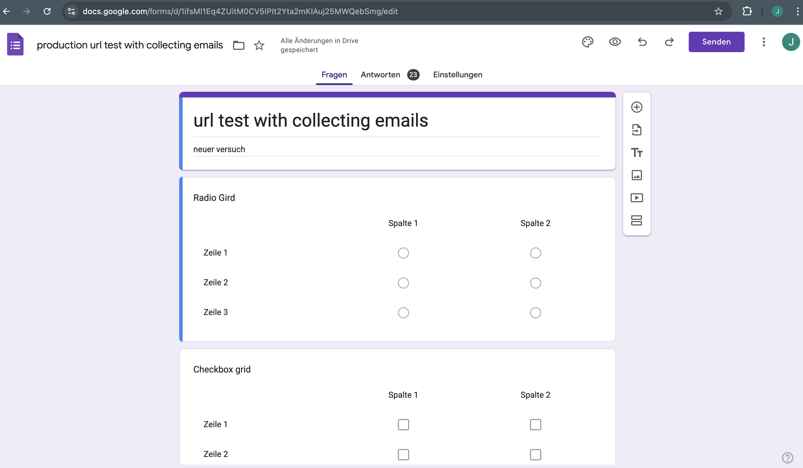

3. **Log in to the website**: This project is in its development mode, so only authorized users can log in. I have added samuel.boguslawski@code.berlin as an authorized user for the assessment.

4. **Paste the link in the input field and click the create button**:
   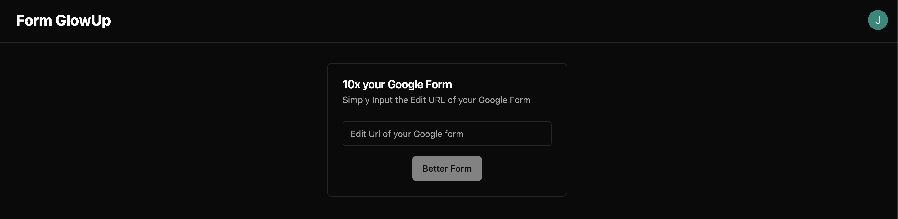

5. **The website will create a new form with the same questions as the original form**: You will be redirected to the edit page of the new form.

6. **Style your form**: When you make changes in the original Google Form, you can simply press refresh and the form will be updated locally.

7. **Update the form once you are happy with the result**.

8. **Share the form with others**: Submitted data will be sent to Google.

## How to run the project

### Setup a Google Cloud Project

1. Head to the [Google Cloud website](https://console.cloud.google.com) and create a new project.
2. Once the project is created, head to the API & Services section:
   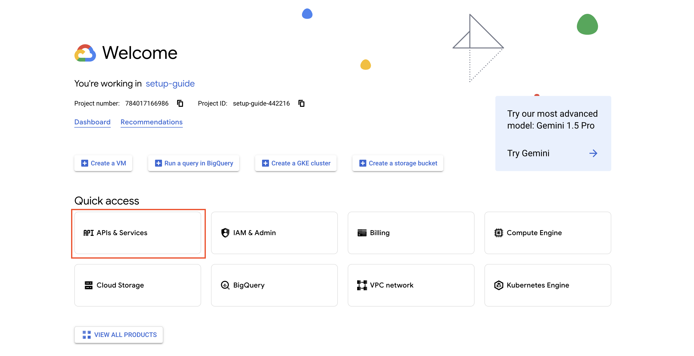
3. Create an OAuth screen by heading to the OAuth consent screen page.
4. Configure your OAuth screen. For this project, you need to add `https://www.googleapis.com/auth/forms.body.readonly`:
   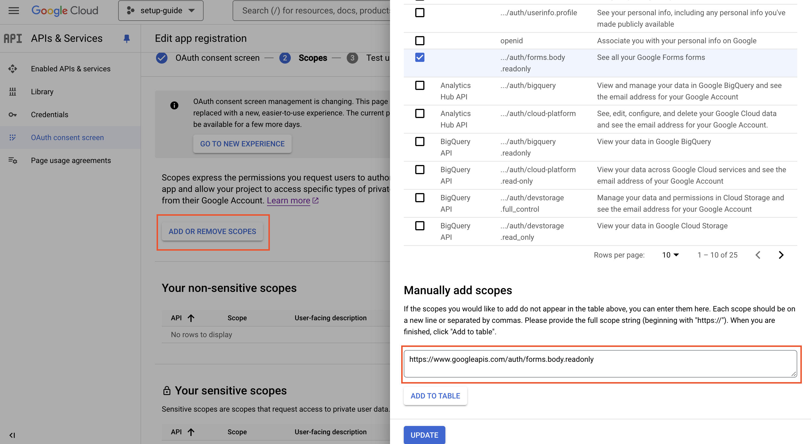
5. When starting your project in development mode, add the emails of your test users:
   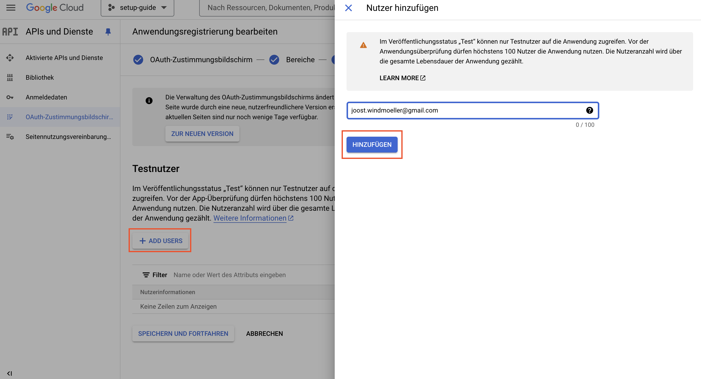
6. Create OAuth-Client credentials by heading to the credentials page, clicking on new credentials, and selecting the OAuth option:
   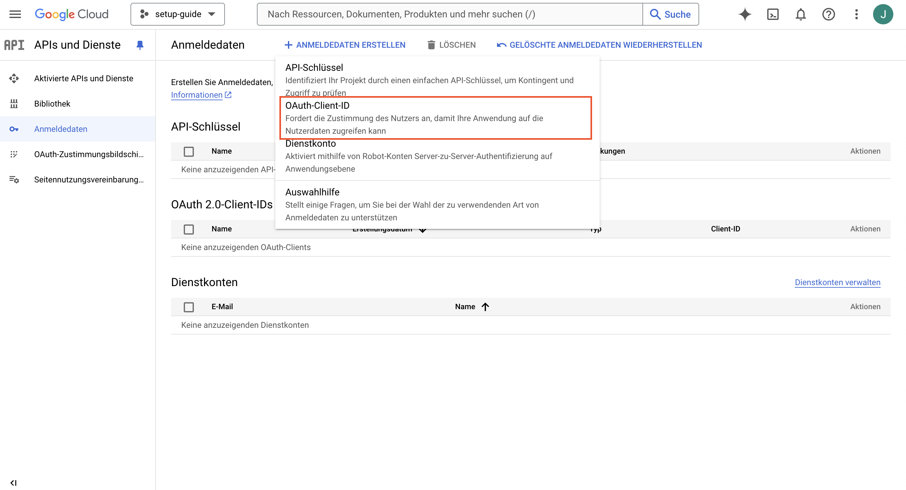
7. Select web as your type of application. Then add your localhost as an authorized JS origin and `localhost/auth/callback/google` for the redirect URL:
   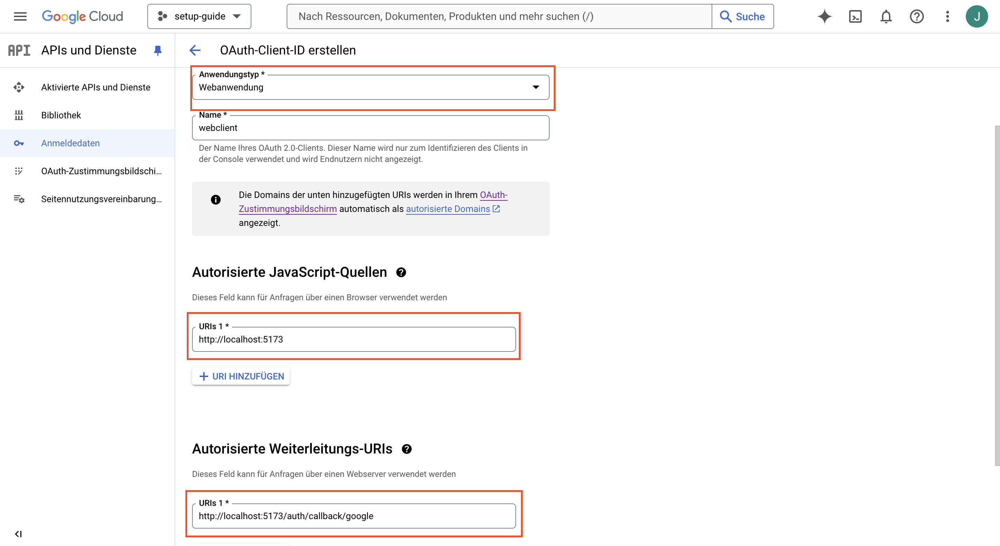
8. Copy your client ID and secret into your `.env` file.

9. Activate the Google Forms API by heading to APIs and Services and clicking activate:
   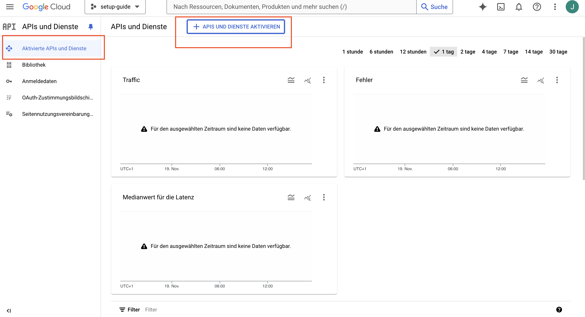
10. Search for the Google Forms API and activate it:
    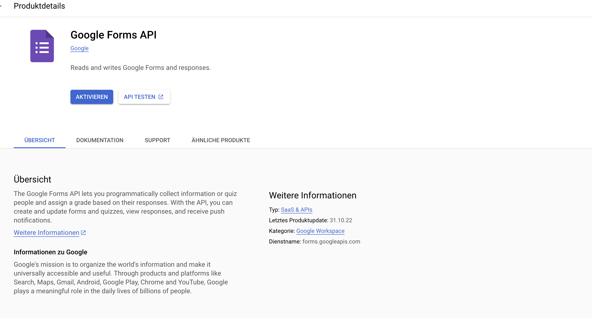

### Setup the Firestore Project

1. Head to the [Firebase console](https://console.firebase.google.com/) and create a new app.
2. Create a Firebase project.
3. Initialize the Firestore database.
4. Create the admin account for that app by clicking on the settings icon and selecting the users and permissions option:
   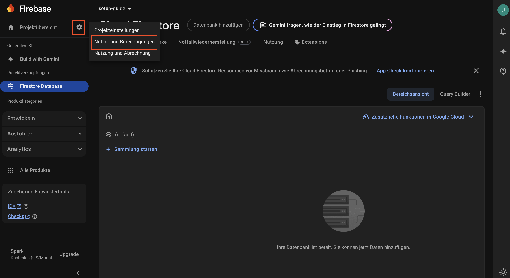
5. Select the service account tab and click on create new private key:
   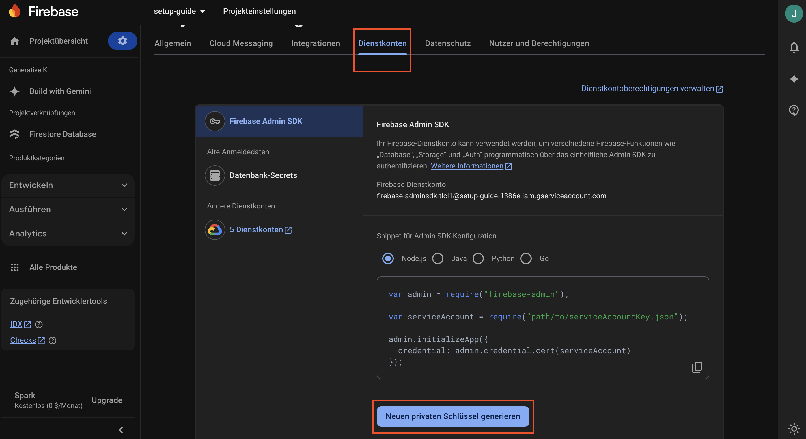
6. Once the key is created, a JSON file is automatically downloaded. Copy the `project_id`, `private_key`, and `client_email` into your `.env` file.

### Setup Auth.js

1. Run `npm exec auth secret` once. This will generate a new random token to encrypt tokens.

### Run Locally

1. Clone the repository.
2. Install the dependencies with `npm install`.
3. Paste your environment variables in the `.env` file.
4. Run the development server with `npm run dev`.
